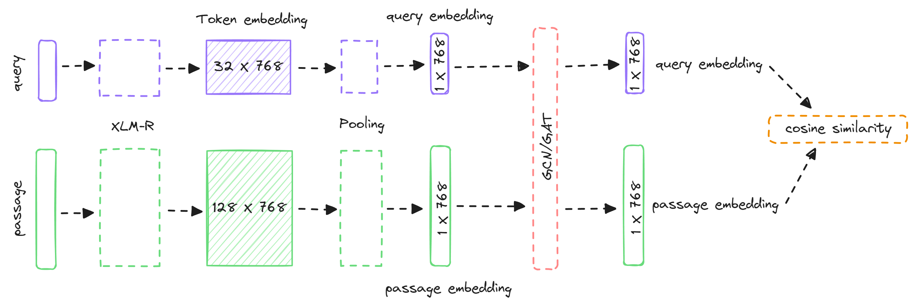

# 24-4-工作汇报

### 1 主要工作

[huggingface transformers](https://huggingface.co/)

阅读、调试、理解了部分transformers包的源码，重写了自已的代码，使其更加具有结构和逻辑。

### 2 方法

将query和passage分别输入多语言预训练XLM-R[^1]模型进行编码，得到query和passage的向量表示embedding，然后将query embedding和passage embedding做余弦相似度计算，使用交叉熵损失对模型进行优化（微调）。

### 3 实验

> 代码地址：[https://gitcode.com/bajiuqier/clir/tree/main/myself](https://gitcode.com/bajiuqier/clir/tree/main/myself)

#### 3.1 数据集

mMarco[^2]跨语言信息检索数据集-中英10w条数据

#### 3.2 实验参数设置

|   参数/超参数    |  值  |
| :--------------: | :--: |
|       epch       |  20  |
|    batch_size    |  32  |
| query_max_length |  32  |
|  doc_max_length  | 128  |
|  learning_rate   | 3e-5 |
|   warmup_ratio   | 0.1  |

#### 3.3 实验结果

|       | R@10  | R@100 | NDCG@5 | NDCG@10 |
| ----- | ----- | ----- | ------ | ------- |
| mBERT | 0.416 | 0.651 | 0.214  | 0.237   |
| XLM-R | 0.411 | 0.655 | 0.197  | 0.226   |
|       |       |       |        |         |

[^1]:Conneau A, Khandelwal K, Goyal N, et al. Unsupervised Cross-lingual Representation Learning at Scale[C]//Proceedings of the 58th Annual Meeting of the Association for Computational Linguistics. 2020: 8440-8451.
[^2]:Bonifacio L, Jeronymo V, Abonizio H Q, et al. mmarco: A multilingual version of the ms marco passage ranking dataset[J]. arXiv preprint arXiv:2108.13897, 2021.

## 4 预采用方法

添加一个GNN模块，可以是GCN或者GAT，来增强查询的语义表示能力。

