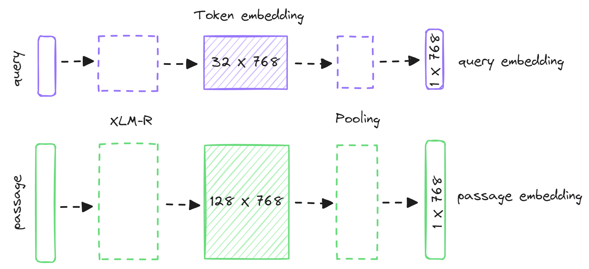
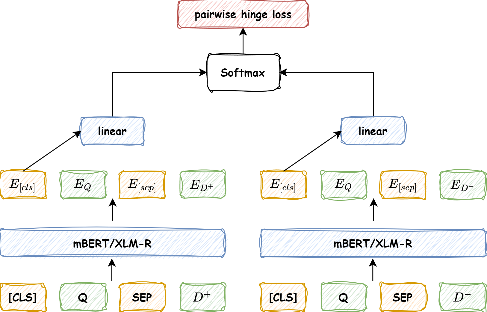

## 1 主要工作

使用 dual_architecture 结构进行实验，遇到了许多问题。例如模型训练没有效果、数据量太大训练时间长等。

由于在dual_architecture 结构下实验没有效果，所以更换使用 cross_architecture，已经做了初步的 baseline 实验。

## 2 dual_architecture 实验

dual_architecture 实验的基本结构如上图所示，遇到的一个非常严重的问题就是，无论怎么训练模型，测试时模型输出的 query 和 document 的向量的预先相似度永远都在0.9以上，无论是正样本还是负样本。

问题排除：

1. 训练集构建时 负样本的选择是否错误

2. 计算相似度时，batch内的维度是不是搞错了，导致正负样本没有分离

3. 超参数：学习率、batch_size、优化器的正则化项是否合理、模型的参数是否被冻结了

   。。。。。

两个向量的余弦相似度总是在0.9以上的可能原因：

1. **余弦相似度的解释**：余弦相似度衡量的是向量之间的夹角，而不是它们之间的距离。即使两个向量在向量空间中的距离较远，但如果它们的夹角较小，余弦相似度也可能较高。
2. **向量归一化问题**：如果向量的 L2 范数非常接近 1，那么余弦相似度计算会变得不太可靠，尤其是当向量本身接近标准化向量时。
3. **向量表示空间的稀疏性**：预训练语言模型生成的向量空间通常非常高维，这样的高维空间中，向量之间的差异可能变得不那么明显，即使是不同的句子，也可能产生高度相似的向量。这种情况在某些特定模型和数据集上可能会更加明显。
4. **句子长度和内容的影响**：如果输入的句子非常短或者缺乏语义内容（例如，仅仅是一个词或无意义的词组），模型可能会产生相似的向量表示。试着用一些更长且语义明确的句子进行测试，看是否会产生不同的结果。

>  **总结：**可能是由于 query 的稀疏性，导致 query 和 document 的向量在高维空间中的差距不大。
>
> 数据稀疏的问题，还待读论文检索解决方法。

## 3 cross_architecture 实验

### 3.1 基本结构

将query和document的正负样本对输入多语言预训练 mBERT 或 XLM-R[^1] 模型，使用最后得到的 [CLS] 标记的表示经过一个前馈神经网络，得到 query 和当前 document 的相似度得分，将得到的 query 的正负样本的相似度得分进行 Softmax 之后，使用 pairwise hinge loss 对模型进行优化。

> 代码地址：https://github.com/bajiuqier/clir/tree/main/cross_architecture

### 3.2 数据集

CLIRMatrix[^2]跨语言信息检索数据集BI-139中的zh-kk数据的base版本。

|       | zh-query | kk-document |
| :---: | :------: | :---------: |
| train |   9999   |    19998    |
|  dev  |   1000   |   100000    |
| test1 |   1000   |   100000    |
| test2 |   1000   |   100000    |

训练时，将与 query 相似度最高的 1 个 document 作为正样本，另外随机选择一个相似度为 0 的 document 作为负样本。测试时，使用 1000 个 query 的 BM25 算法的前 100 个结果，作为测试数据，不够 100 个文档的情况下 将随机选择相关度为 0 的 document，确保 每个 query 都有 100 个候选文档待重新排序。

### 3.3 实验参数设置

|  参数/超参数  |  值   |
| :-----------: | :---: |
|     epch      |  15   |
|  batch_size   |  32   |
|  max_length   |  256  |
|   optimizer   | AdamW |
| learning_rate | 1e-5  |

### 3.4 实验结果

|       | MRR@5  | MRR@10 | NDCG@5 | NDCG@10 |
| :---: | :----: | :----: | :----: | :-----: |
| mBERT | 86.79% | 87.16% | 70.41% | 74.26%  |
| XLM-R | 85.86% | 86.32% | 68.80% | 73.04%  |

### 3.5 接下的工作

1. 补充对比试验，CEDR-DRMM、CEDR-KNRM、CEDR-PACRR等
2. 将图神经网络、主题模型添加进网络中，实验是否有性能提升
3. 补充之前丢下的 中哈知识图谱的构建

[^1]:Conneau A, Khandelwal K, Goyal N, et al. Unsupervised Cross-lingual Representation Learning at Scale[C]//Proceedings of the 58th Annual Meeting of the Association for Computational Linguistics. 2020: 8440-8451.
[^2]:Sun S, Duh K. CLIRMatrix: A massively large collection of bilingual and multilingual datasets for Cross-Lingual Information Retrieval[C]//Proceedings of the 2020 Conference on Empirical Methods in Natural Language Processing (EMNLP). 2020: 4160-4170.

