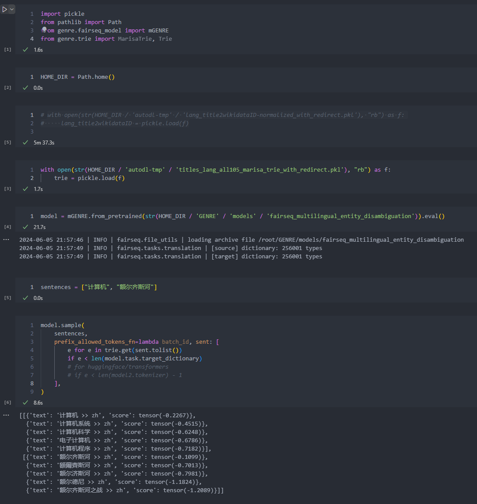

## 中哈知识图谱的构建

使用 mGENRE 来将中文的实体链接到 wikidata 的实体

32G 的内存不够用，至少需要 54G 内存




## Dual Architecture


## Cross Architecture

### 模型1


#### 数据集

CLIRMatrix跨语言信息检索数据集BI-139中的zh-kk数据的base版本。

|       | zh-query | kk-document |
| :---: | :------: | :---------: |
| train |   9999   |    19998    |
|  dev  |   1000   |   100000    |
| test1 |   1000   |   100000    |
| test2 |   1000   |   100000    |

#### 实验参数设置

```python
epch = 15   
batch_size = 32   
max_length = 256  
optimizer : AdamW 
learning_rate = 1e-5  
```

#### 评测结果

|       |  R@5   |  R@10  | MRR@5  | MRR@10 | NDCG@5 | NDCG@10 |
| :---: | :----: | :----: | :----: | :----: | :----: | :-----: |
| mBERT | 57.37% | 72.85% | 86.79% | 87.16% | 70.41% | 74.26%  |
| XLM-R | 58.04% | 73.97% | 85.86% | 86.32% | 68.80% | 73.04%  |


